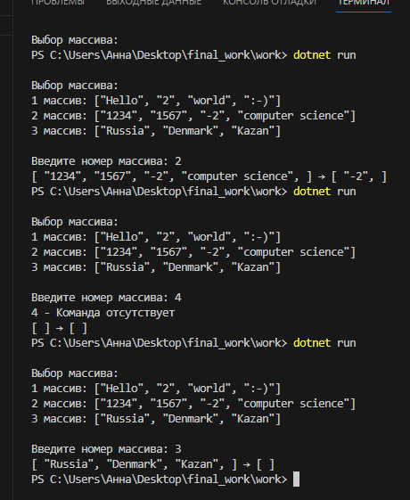
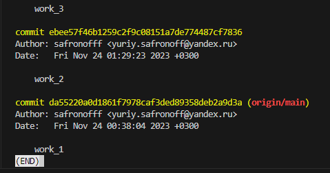
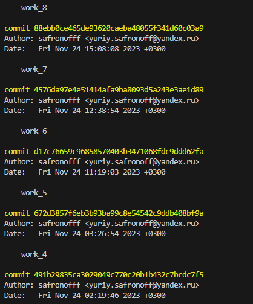
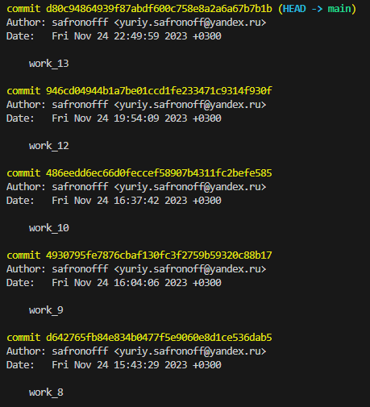

# Итоговая контрольная работа по основному блоку

## Урок 1. Контрольная работа
Данная работа необходима для проверки ваших знаний и навыков по итогу прохождения первого блока обучения на программе Разработчик. Мы должны убедится, что базовое знакомство с IT прошло успешно.

Задача алгоритмически не самая сложная, однако для полноценного выполнения проверочной работы необходимо:

1. Создать репозиторий на GitHub
2. Нарисовать блок-схему алгоритма (можно обойтись блок-схемой основной содержательной части, если вы выделяете её в отдельный метод)
3. Снабдить репозиторий оформленным текстовым описанием решения (файл README.md)
4. Написать программу, решающую поставленную задачу
5. Использовать контроль версий в работе над этим небольшим проектом (не должно быть так, что всё залито одним коммитом, как минимум этапы 2, 3, и 4 должны быть расположены в разных коммитах)

**Задача:**

Написать программу, которая из имеющегося массива строк формирует новый массив из строк, длина которых меньше, либо равна 3 символам. Первоначальный массив можно ввести с клавиатуры, либо задать на старте выполнения алгоритма. При решении не рекомендуется пользоваться коллекциями, лучше обойтись исключительно массивами.

**Примеры:**

[“Hello”, “2”, “world”, “:-)”] → [“2”, “:-)”]
[“1234”, “1567”, “-2”, “computer science”] → [“-2”]
[“Russia”, “Denmark”, “Kazan”] → []

## Решение:

1. Как показанно в коде, мы задаем выбор одного из предлагаемых массивов через конструкцию *switch/case*

```cs
   Commands();
string[] array = new string[] { };

string NumArray = ReadInput("Введите номер массива: ");
switch (NumArray)
{
    case "1":
        array = new string[] { "Hello", "2", "world", ":-)" };
        break;
    case "2":
        array = new string[] { "1234", "1567", "-2", "computer science" };
        break;
    case "3":
        array = new string[] { "Russia", "Denmark", "Kazan" };
        break;
    default:
        Console.WriteLine($"{NumArray} - Команда отсутствует");
        break;
}

```

2. Как показанно в блок-схеме ниже, мы задаем выбранному массиву длинну на каждый элемент не более трех символов и перезаписываем его в новый массив.


```cs

int lenArray = 0;
for (int i = 0; i <= array.Length - 1; i++)
{
    if (array[i].Length <= 3)
        lenArray++;
}


string[] newArray = new string[lenArray];
int x = 0;

for (int i = 0; i <= array.Length - 1; i++)
{
    if (array[i].Length <= 3)
    {
        newArray[x] = array[i];
        x++;
    }
}

```

3. Далее мы используем функцию вывода команды для работы с программой

```cs

void Commands()
{
    Console.WriteLine();
    Console.WriteLine("Выбор массива:");
    Console.WriteLine("1 массив: [“Hello”, “2”, “world”, “:-)”]");
    Console.WriteLine("2 массив: [“1234”, “1567”, “-2”, “computer science”]");
    Console.WriteLine("3 массив: [“Russia”, “Denmark”, “Kazan”]");
    Console.WriteLine();
}

```

4. Далее используем функцию ввода номера выбранного массива

```cs

string ReadInput(string arnum)
{
    Console.Write(arnum);
    return Console.ReadLine();
}

```

5. Следом идет функция вывода сформированного массива  в терминал

```cs

void PrintArray(string[] array)
{
    Console.Write("[ ");
    for (int i = 0; i < array.Length; i++)
    {
        Console.Write($"“{array[i]}”, ");
    }
    Console.Write("] ");
}

```

6. В конце следует печать результата в терминал

```cs

PrintArray(array);
Console.Write("→ ");
PrintArray(newArray);

```

Как мы видем на скриншоте, получается следующий результат вывода в терминал:



Скриншоты комитов:






